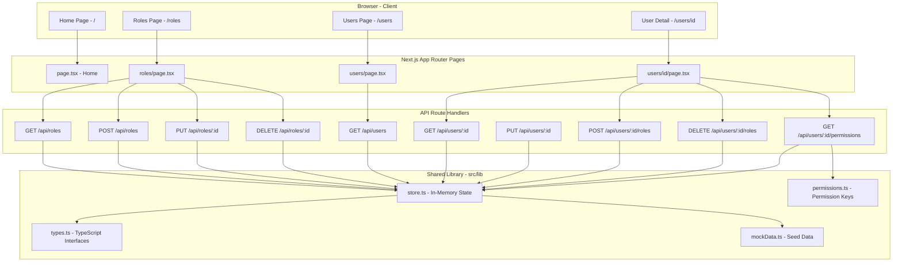
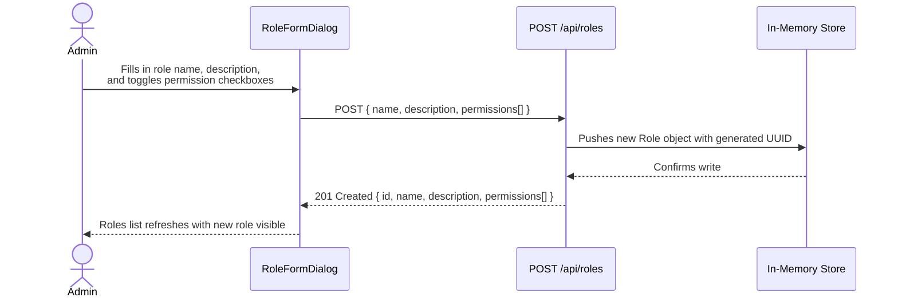
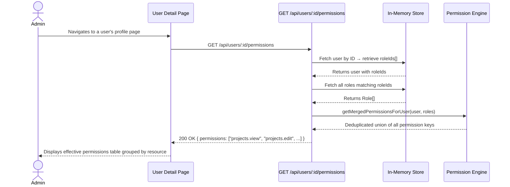
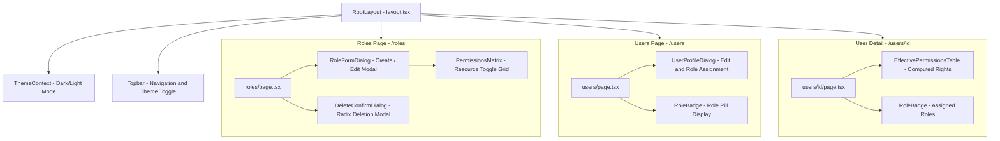

# 🏗️ Workbench — System Architecture

> **Workbench** is a SaaS admin platform that empowers team admins to create custom roles, assign granular permissions, and manage user access — all without touching code.

---

## 📌 Table of Contents

1. [Product Overview](#-product-overview)
2. [Technology Stack](#-technology-stack)
3. [Project Structure](#-project-structure)
4. [System Architecture Diagram](#-system-architecture-diagram)
5. [Data Flow](#-data-flow)
6. [Permission Resolution Engine](#-permission-resolution-engine)
7. [API Reference](#-api-reference)
8. [Component Hierarchy](#-component-hierarchy)
9. [Key Design Decisions](#-key-design-decisions)

---

## 🎯 Product Overview

Workbench solves a real problem in SaaS teams: **one-size-fits-all roles don't fit all teams.**

| Without Workbench | With Workbench |
|---|---|
| Fixed roles: Owner, Admin, Member, Viewer | Fully custom roles with any name |
| Cannot restrict delete vs edit separately | Granular per-resource permission toggles |
| No auditability of who has what access | Per-user effective permissions viewer |
| New role = code change + redeployment | New role = 30 seconds in the UI |

### Core Capabilities
- ✅ Create, edit, and delete custom roles
- ✅ Fine-grained permission control per resource (Projects, Tasks, Members, Billing, Settings)
- ✅ Assign multiple roles to a single user
- ✅ Effective permissions computed in real-time via Additive Union
- ✅ User profile management with role assignment
- ✅ Home page preview card dynamically reflects live roles from the API
- ✅ Role deletion uses a premium custom confirmation dialog (Radix primitives)

---

## 🛠️ Technology Stack

| Layer | Technology | Reason |
|---|---|---|
| **Framework** | Next.js 15 (App Router) | Unified full-stack TypeScript, no extra backend needed |
| **Language** | TypeScript | End-to-end type safety for roles, users, and permissions |
| **Styling** | Tailwind CSS v4 | Rapid, consistent dark-mode SaaS design system |
| **Icons** | Lucide React | Clean, professional SVG icon set |
| **State (Server)** | Node.js `global` in-memory store | Simple, zero-dependency persistence for the session |
| **Rendering** | React Server + Client Components | Optimised page loads with interactive islands |

---

## 📁 Project Structure

```
workbench/
│
├── src/
│   ├── app/                          # Next.js App Router — Pages & API
│   │   ├── page.tsx                  # 🏠 Home Page — dynamically fetches and renders live roles preview
│   │   ├── layout.tsx                # Root layout with ThemeProvider
│   │   ├── globals.css               # Global Tailwind base styles
│   │   │
│   │   ├── roles/
│   │   │   └── page.tsx              # 🔑 Roles Management Page
│   │   │
│   │   ├── users/
│   │   │   ├── page.tsx              # 👥 Users List Page
│   │   │   └── [id]/
│   │   │       └── page.tsx          # 👤 User Detail / Permission Page
│   │   │
│   │   └── api/                      # RESTful API Route Handlers
│   │       ├── roles/
│   │       │   ├── route.ts          # GET /api/roles  |  POST /api/roles
│   │       │   └── [id]/
│   │       │       └── route.ts      # PUT /api/roles/:id  |  DELETE /api/roles/:id
│   │       │
│   │       └── users/
│   │           ├── route.ts          # GET /api/users
│   │           └── [id]/
│   │               ├── route.ts      # GET /api/users/:id  |  PUT /api/users/:id
│   │               ├── roles/
│   │               │   └── route.ts  # POST /api/users/:id/roles  |  DELETE /api/users/:id/roles
│   │               └── permissions/
│   │                   └── route.ts  # GET /api/users/:id/permissions
│   │
│   ├── components/                   # Reusable UI Components
│   │   ├── ThemeContext.tsx          # 🌙 Dark/Light mode context provider
│   │   ├── layout/
│   │   │   └── Topbar.tsx            # Global navigation bar
│   │   ├── roles/
│   │   │   ├── RoleFormDialog.tsx    # Create / Edit role modal with permissions
│   │   │   └── PermissionsMatrix.tsx # Interactive permission toggle grid
│   │   └── users/
│   │       ├── UserProfileDialog.tsx # User profile edit & role assignment modal
│   │       ├── RoleBadge.tsx         # Styled badge to display a user's role
│   │       └── EffectivePermissionsTable.tsx  # Computed permissions display
│   │
│   └── lib/                          # Shared Business Logic & Data
│       ├── types.ts                  # TypeScript interfaces (User, Role, Permission)
│       ├── permissions.ts            # Permission key definitions & resource groupings
│       ├── mockData.ts               # Seed data for initial users and roles
│       └── store.ts                  # In-memory server store (global.__users_store)
│
├── Architecture.md                   # 📐 This document
├── README.md                         # Project setup guide
├── package.json
├── next.config.ts
└── tsconfig.json
```

---

## 🗺️ System Architecture Diagram



---

## 🔄 Data Flow

### Creating a Role



### Resolving Effective Permissions



---

## 🔐 Permission Resolution Engine

### Strategy: Additive Union

When a user holds **multiple roles**, their final permissions are the **union of all permissions** across those roles. No role can revoke a permission granted by another.

```
User "Alice"
├── Role: "Project Editor"   → permissions: [projects.view, projects.edit]
└── Role: "Report Viewer"    → permissions: [reports.view]

Effective Permissions (Union):
  → projects.view ✅
  → projects.edit ✅
  → reports.view  ✅
```

### Algorithm

```typescript
// src/lib/store.ts
export function getMergedPermissionsForUser(user: User, rolesList: Role[]): string[] {
  const userRoles = rolesList.filter(role => user.roleIds.includes(role.id));
  const allPermissions = userRoles.flatMap(role => role.permissions);
  return Array.from(new Set(allPermissions));  // Deduplicate
}
```

### Permission Key Schema

All permissions follow the `resource.action` naming pattern:

| Resource | Available Actions |
|---|---|
| `projects` | `view` · `create` · `edit` · `delete` · `archive` |
| `tasks` | `view` · `create` · `edit` · `delete` · `assign` |
| `members` | `view` · `invite` · `remove` · `update_role` |
| `billing` | `view` · `update` · `download_invoices` |
| `settings` | `view` · `update` |

> This gives **19 total permission keys** across 5 resources, providing fine-grained control over every area of the platform.

---

## 🌐 API Reference

### Roles

| Method | Endpoint | Description | Request Body | Response |
|---|---|---|---|---|
| `GET` | `/api/roles` | List all roles | — | `Role[]` |
| `POST` | `/api/roles` | Create a new role | `{ name, description, permissions[] }` | `Role` (201) |
| `PUT` | `/api/roles/:id` | Update a role | `{ name, description, permissions[] }` | `Role` (200) |
| `DELETE` | `/api/roles/:id` | Delete a role | — | `204 No Content` |

### Users

| Method | Endpoint | Description | Request Body | Response |
|---|---|---|---|---|
| `GET` | `/api/users` | List all users | — | `User[]` |
| `GET` | `/api/users/:id` | Get user by ID | — | `User` |
| `PUT` | `/api/users/:id` | Update user profile | `{ name, email, avatarUrl }` | `User` |
| `POST` | `/api/users/:id/roles` | Assign role to user | `{ roleId }` | `User` |
| `DELETE` | `/api/users/:id/roles` | Remove role from user | `{ roleId }` | `User` |
| `GET` | `/api/users/:id/permissions` | Get merged permissions | — | `{ permissions: string[] }` |

---

## 🧩 Component Hierarchy



---

## 💡 Key Design Decisions

### 1. Why Next.js App Router (not a separate backend)?
The brief required TypeScript on both the frontend and the API. Using Next.js Route Handlers removes the need for a separate Express/Fastify server, keeping the entire codebase in one repo with shared types — ideal for a lean admin tool.

### 2. Why In-Memory Store (not a database)?
For a focused admin tool demo, in-memory state provides instant feedback with zero configuration. Data persists across browser refreshes by attaching state to Node's `global` object, which survives hot-reloads in the dev server.

```typescript
// Pattern used in store.ts to survive Next.js hot-reloads
global.__users_store = global.__users_store ?? [...initialUsers];
global.__roles_store = global.__roles_store ?? [...initialRoles];
```

### 3. Why Additive Union for permissions?
Enterprise RBAC systems (AWS IAM, GitHub, Google Workspace) universally treat permissions as additive. The alternative (most-restrictive wins) would mean assigning a second role could accidentally revoke rights — breaking the principle of least surprise for admins.

### 4. Why `resource.action` permission key format?
This schema is both **human-readable** and **extensible**. Adding a new resource (e.g., `api_keys`) requires zero schema changes — just define the new keys in `permissions.ts`. The permission matrix UI auto-groups them by prefix.

### 5. Why a custom Radix Dialog for role deletion (not `window.confirm`)?
Native `window.confirm` popups are suppressed by some modern browsers in certain contexts (iframes, headless testing, extensions). A custom Radix `Dialog` gives full styling control, integrates with the design system, and provides a predictable, accessible UX on all platforms.

### 6. Why does the Home page fetch roles from `/api/roles` at runtime?
The homepage preview card needs to reflect the live state of the role store — including newly created or deleted roles. A static render would only show seed data. Using `useEffect` + `fetch` on the client side ensures the card is always up-to-date with the actual in-memory store.

---

## 🚀 Running Locally

```bash
# 1. Install dependencies
npm install

# 2. Start the development server
npm run dev

# 3. Open in browser
open http://localhost:3000
```

---

*Built with ❤️ using Next.js, TypeScript, and Tailwind CSS*
